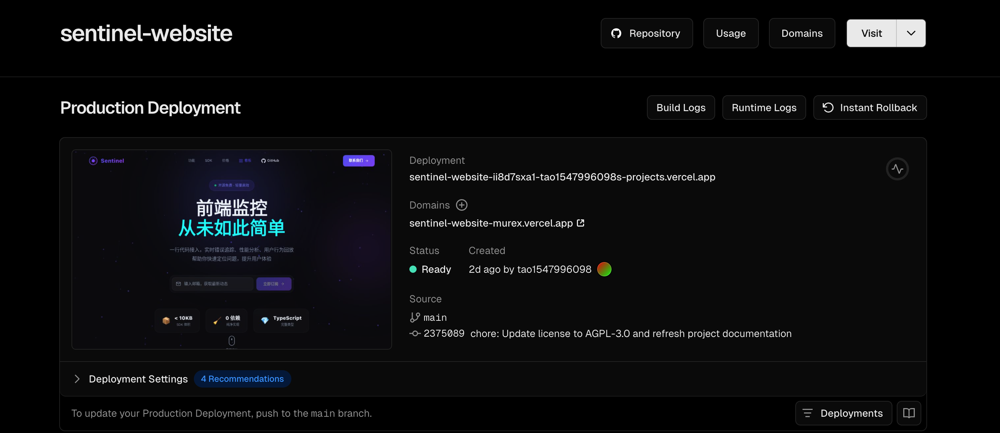

<h1 align="center">Hi 👋, I'm majuntao</h1>
<h3 align="center">A passionate developer</h3>

  

---

### 🚀 My Projects

| Project | Description | Link |
|---------|-------------|------|
| Sentinel Website | 安全相关项目 | [🔗 Live Demo](https://sentinel-website-murex.vercel.app/) |
| Web Security Lab | Web 安全实验室 | [🔗 Live Demo](https://web-security-lab-server.vercel.app/) |

---

### 🛠️ Tech Stack

  
  
  
  

---

### 📊 GitHub Stats

  

---

### 📫 Contact Me

- GitHub: [@name718](https://github.com/name718)
